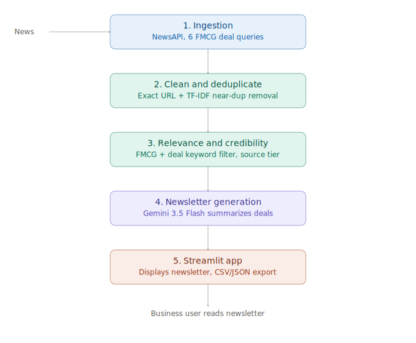

# FMCG Deal Intelligence Newsletter

An agentic pipeline that sources, cleans, filters, and summarizes recent FMCG (Fast-Moving Consumer Goods) M&A and investment news into a concise, skimmable newsletter — built for the Benori AI Engineer assignment.

**Live demo:** _add your Streamlit Cloud URL here_

## Problem statement

Create a solution that generates a concise FMCG industry intelligence newsletter on recent M&A and investment activity using publicly available news, with real-time data sourcing, deduplication, relevance filtering, and basic source credibility checks.

## Architecture



The pipeline has five stages, each a standalone, testable Python module:

| Stage | Module | What it does |
|---|---|---|
| 1. Ingestion | `src/ingest.py` | Queries NewsAPI across 6 FMCG-deal-related search terms (acquisition, merger, funding, investment, etc.) |
| 2. Clean & deduplicate | `src/clean.py` | Drops malformed/removed articles, exact-URL duplicates, and near-duplicate stories (same deal reported by multiple outlets) using TF-IDF + cosine similarity on titles |
| 3. Relevance & credibility | `src/score.py` | Keeps only articles that mention both an FMCG term and a deal term (and excludes articles that mention unrelated sectors like oil/petroleum); tags each source as Tier 1 (trusted business outlets) or Tier 2 |
| 4. Newsletter generation | `src/newsletter.py` | Sends the structured, scored article list to Gemini 3.5 Flash, which writes a business-readable newsletter (highlights, deal roundup, closing insight) |
| 5. Demo app | `app/app.py` | Streamlit app that runs the full pipeline live on a button click and displays the result |

## Pipeline logic explained

**De-duplication:** Since the same deal is often covered by multiple outlets with slightly different wording, exact-URL duplicates are dropped first, then remaining articles are compared pairwise using TF-IDF vectorization + cosine similarity on titles (threshold 0.75). When two articles are near-duplicates, the one with the longer/richer description is kept.

**Relevance filtering:** An article is kept only if it mentions **both** (a) an FMCG-related term — either a known company/brand (HUL, ITC, Nestlé, etc.) or a broader category term (beverage, snack, dairy, personal care, etc.) — **and** (b) a deal-related term (acquisition, funding, stake, IPO, etc.). A negative-keyword list (petroleum, refinery, banking license, etc.) excludes multi-topic market-roundup articles that mention an FMCG company only in passing alongside unrelated sector news.

**Credibility scoring:** Sources are tagged Tier 1 (Reuters, Economic Times, Mint, Business Standard, Bloomberg, etc.) or Tier 2 (everything else). This is a transparent, rule-based whitelist rather than a black-box score. Tier 2 items are explicitly flagged in the generated newsletter as not independently corroborated by a Tier 1 outlet.

**Newsletter generation:** The scored, deduplicated article list (title, description, source, tier, URL) is passed to Gemini with a structured prompt asking for a "Top Highlights" section, a "Deal Roundup" with 2-3 line summaries per article, and a closing note on any sector patterns — grounded only in the provided articles, not invented.

## Known limitations

- Keyword-based relevance filtering is precision-oriented over recall — some genuine FMCG deals that don't use common category words (e.g. a niche coffee brand acquisition with no FMCG-sector keyword) may be missed.
- NewsAPI's free tier limits results to the last month and 100 requests/day.
- Credibility tiering is a static whitelist, not a live reputation score.

## Setup & running locally

```bash
git clone https://github.com/Rupa-sharon/fmcg-deal-intelligence-newsletter.git
cd fmcg-deal-intelligence-newsletter
python -m venv venv
venv\Scripts\activate        # Windows
# source venv/bin/activate   # Mac/Linux
pip install -r requirements.txt
```

Set your API keys (get free keys at [newsapi.org](https://newsapi.org/register) and [aistudio.google.com/apikey](https://aistudio.google.com/apikey)):

```powershell
$env:NEWSAPI_KEY="your_key_here"
$env:GEMINI_API_KEY="your_key_here"
```

Run the pipeline stages individually:

```bash
python src/ingest.py       # -> data/raw_articles.json
python src/clean.py        # -> data/clean_articles.json
python src/score.py        # -> data/scored_articles.json
python src/newsletter.py   # -> data/newsletter.md
```

Or run the interactive demo app:

```bash
streamlit run app/app.py
```

## Tech stack

Python, NewsAPI, scikit-learn (TF-IDF), Google Gemini API (`google-genai`), Streamlit.

## Deliverables

- Demo app: Streamlit (see live link above)
- Source code: this repository
- Raw data: `data/raw_articles.json`, `data/clean_articles.json`, `data/scored_articles.json`
- Newsletter output: `data/newsletter.md`
- Architecture diagram: `architecture.svg` (above)
